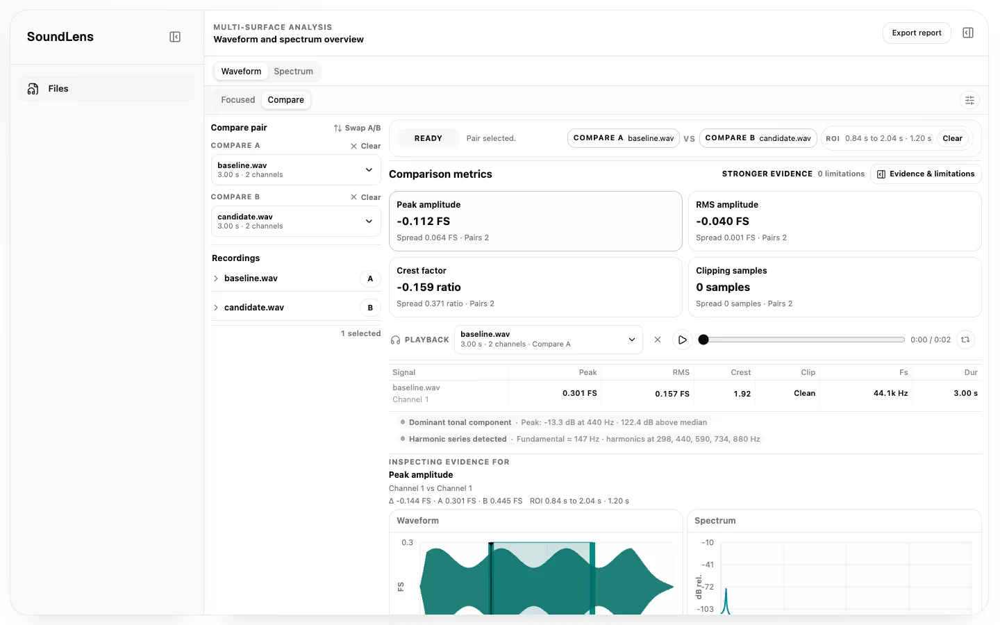
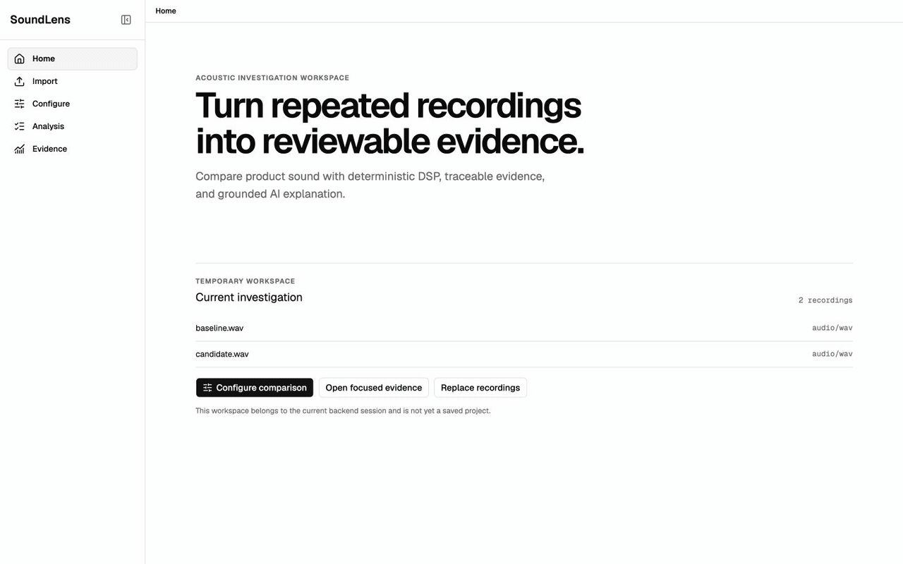
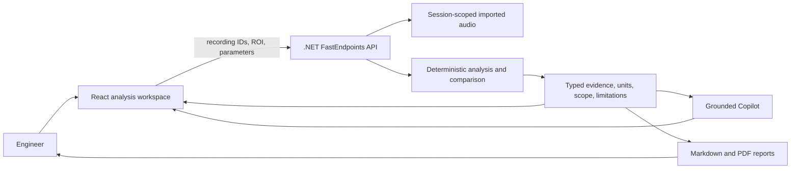

# SoundLens

**AI-assisted acoustic investigation and product-sound benchmarking grounded in deterministic DSP evidence.**

[](https://github.com/jci24/SoundLens/actions/workflows/ci.yml)
[](LICENSE)

SoundLens helps acoustic and product-sound engineers compare repeated recordings, inspect the evidence behind a difference, and turn the result into a traceable explanation or report. It is an active validation-stage prototype currently testing automotive NVH as its leading customer hypothesis, with machinery and broader product-sound teams as adjacent discovery segments.



## Workflow

Move through a functional investigation flow: restore or import a temporary workspace, configure the active A/B pair, select deterministic analyses, inspect backend-computed evidence, audition recordings or isolated channels, ask Copilot follow-up questions, and preview a grounded report.



## Why SoundLens

Repeated-recording investigations often require engineers to move manually between files, plots, calculations, and written notes. That makes it easy to lose the relationship between a conclusion and the exact recording, channel, region, metric, unit, or limitation that supports it.

SoundLens keeps those relationships visible. The product is intentionally validating one narrow workflow first: a defensible comparison between one explicitly selected recording from **Compare A** and one from **Compare B**. That pair is the atomic evidence view for a future campaign-scale workflow, not the intended limit of the product.

## Current Capabilities

- Move through routed Home, Import, Configure, Analysis, and Evidence views with temporary-session restoration and route guards.
- Import WAV recordings through a path-safe browser contract and browse backend-resolved recording and channel metadata.
- Select explicit Compare A and Compare B recordings with accessible replace, clear, and swap controls.
- Choose waveform and spectrum analyses before opening the evidence workspace, or bypass comparison for focused single-signal inspection.
- Render backend-computed waveform and spectrum evidence without recomputing DSP values in the browser.
- Select a waveform region of interest and apply the same validated scope to comparison evidence.
- Review peak, RMS, crest-factor, and clipping differences in a stable domain order without claiming cross-unit importance.
- Inspect aggregate values, aligned signal pairs, coverage, missing evidence, and limitations in a side inspector.
- Audition recordings with seeking, ROI playback and looping, a waveform playhead, position-aligned A/B switching, and isolated-channel routing without modifying evidence.
- Ask Copilot about selected evidence, acoustic theory, investigation guidance, or current external research while keeping measured evidence and cited web sources separate.
- Follow up across a bounded temporary conversation; historical workspace references are revalidated and measurements are recomputed by the backend.
- Review observable preparation activity, evidence sufficiency, structured observations, limitations, trust refusals, and validated citations without exposing private model reasoning.
- Preview and export comparison reports as Markdown or selectable-text PDF using backend-reconstructed evidence.

## Evidence Architecture

```text
LLM plans.
DSP backend computes.
Frontend renders.
LLM explains.
```



The backend is the numerical authority. The frontend sends identifiers and interaction state, not measurements. OpenAI calls remain server-side and receive structured evidence rather than becoming the source of acoustic truth.

## Engineering Highlights

- **Vertical slices:** backend behavior, contracts, frontend interaction, tests, and documentation evolve as small reviewable outcomes.
- **Explicit evidence ownership:** waveform bins, spectrum bins, metrics, units, alignment, ROI scope, and limitations come from the backend.
- **Trust guards:** uncalibrated evidence cannot become a dB SPL claim, observational differences cannot become asserted causes, prior conversation prose cannot become measurement evidence, and malformed model output fails closed.
- **Grounded reporting:** Markdown and PDF share one backend preparation path and remain useful through a deterministic fallback when AI is unavailable.
- **Audition without evidence drift:** browser-native playback, HTTP range requests, position-aligned A/B switching, and Web Audio channel routing add no hidden normalization, effects, or sample changes.
- **Scalable investigation direction:** A/B remains the inspectable evidence primitive while metadata-driven reference-to-many, matched-pair, cohort, and condition-matrix workflows are staged for customer validation.
- **Validation:** deterministic backend tests, React behavior tests, CI, and a repeatable Copilot eval harness cover evidence and refusal behavior.

## Technology

| Area | Stack |
| --- | --- |
| Backend | .NET 10, C#, FastEndpoints, MessagePack, Serilog |
| Frontend | React 19, TypeScript, Vite, React Router, Radix UI, shadcn, Zustand, TanStack Virtual, SCSS |
| AI | Server-side OpenAI Chat and Responses APIs over structured evidence, with bounded cited web search |
| Audio audition | HTMLMediaElement streaming, HTTP ranges, Web Audio channel routing |
| Reporting | Markdown, PDFsharp-MigraDoc, embedded Noto Sans fonts |
| Validation | xUnit, Vitest, React Testing Library, deterministic eval fixtures |

## Run Locally

### Prerequisites

- .NET SDK 10.0.301
- Node.js 22
- npm 10

The .NET SDK version is pinned in [`global.json`](global.json).

### Backend

```bash
cp backend/src/SoundLens.Api/appsettings.Development.local.example.json \
  backend/src/SoundLens.Api/appsettings.Development.local.json

./scripts/run-backend.sh
```

The local override is ignored by Git. Leave `OpenAI:ApiKey` empty for deterministic analysis without Copilot, or set it in that file or through the `OPENAI__APIKEY` environment variable. `OpenAI:WebSearchModel` optionally selects the model used for cited web research and defaults to `gpt-5.6`.

### Frontend

```bash
cd frontend
npm install
npm run dev
```

Open [http://localhost:5173](http://localhost:5173).

### Validate

```bash
dotnet test backend/SoundLens.slnx -nodeReuse:false

cd frontend
npm run test:run
npm run lint
npm run build
```

## Current Boundaries

SoundLens is a validation-stage engineering prototype, not a production acoustic platform.

- Imported recordings and comparison state are temporary and session-scoped.
- Comparison currently supports one active recording per side. Persisted campaigns, reference-to-many analysis, matched cohorts, and condition matrices remain roadmap work.
- Imported evidence is uncalibrated and must not be interpreted as physical dB SPL.
- Findings are bounded observations, not proof of root cause or standards compliance.
- A/B audition is position-aligned rather than sample-accurate, level-matched, or crossfaded. Isolated-channel routing is an audition aid and does not change deterministic evidence.
- Copilot conversation continuity is temporary and limited to the Evidence route; named or persisted conversations, workspace-plus-web synthesis, deep research jobs, and autonomous workspace actions are not implemented.
- The current PDF report is textual and tabular and does not claim PDF/UA conformance.
- Persistent projects, server-owned batch navigation, bounded execution, cancellation, aggregate visualization, and partial-failure isolation remain roadmap work.

See [`CURRENT_STATE.md`](CURRENT_STATE.md) for the precise shipped behavior and [`ROADMAP.md`](ROADMAP.md) for planned validation and engineering milestones.

## Project Documentation

- [Product context](PROJECT_CONTEXT.md)
- [Current state](CURRENT_STATE.md)
- [Roadmap](ROADMAP.md)
- [Backend architecture](docs/backend/README.md)
- [Frontend architecture](docs/frontend/README.md)
- [Domain model](docs/architecture/domain-model.md)
- [Copilot evaluation harness](docs/validation/copilot-answer-evals.md)

## Creator

SoundLens is designed and built by [Jaime Castresana Iza](https://github.com/jci24), including the product direction, acoustic-analysis workflow, backend and frontend architecture, deterministic evidence contracts, AI grounding, reporting, and validation approach.

## License

SoundLens is available under the [MIT License](LICENSE).
